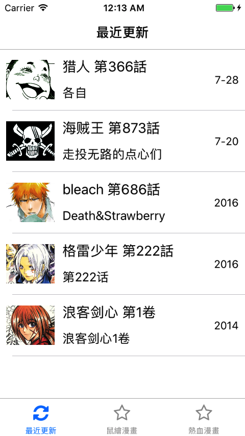
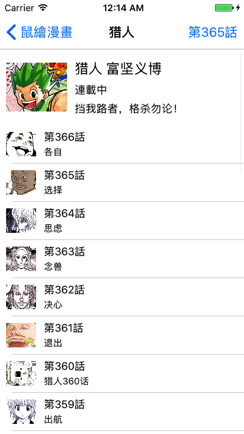

# 鼠绘漫画

##Require

1. Xcode 8.3+, Swift 2.3+
2. Cocoapods 1.1.1+

## Usage

1. Clone the project.
2. Pod install.
3. Enjoy it!

## Copy Right

Only for learning, non-commercial use.

仅供学习，非商业用途。如有侵权，不要打我😂，我只是想看猎人而已.